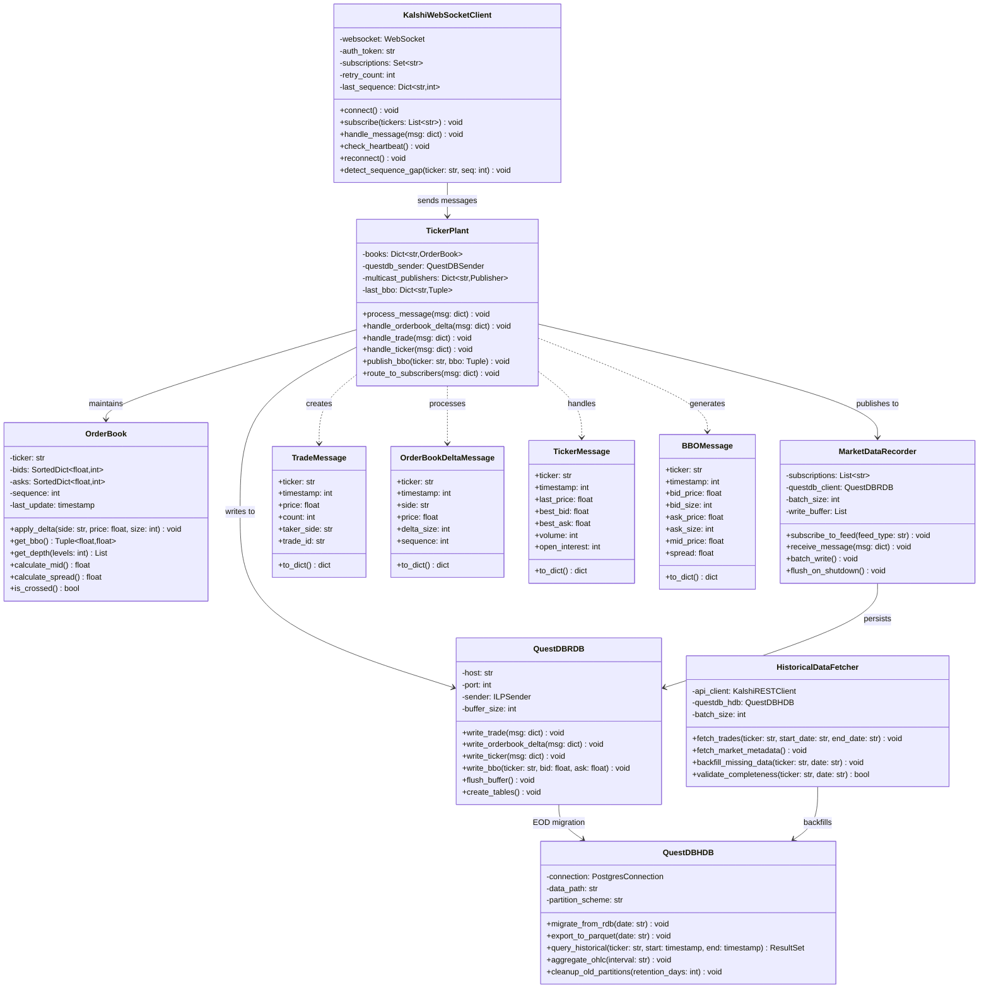
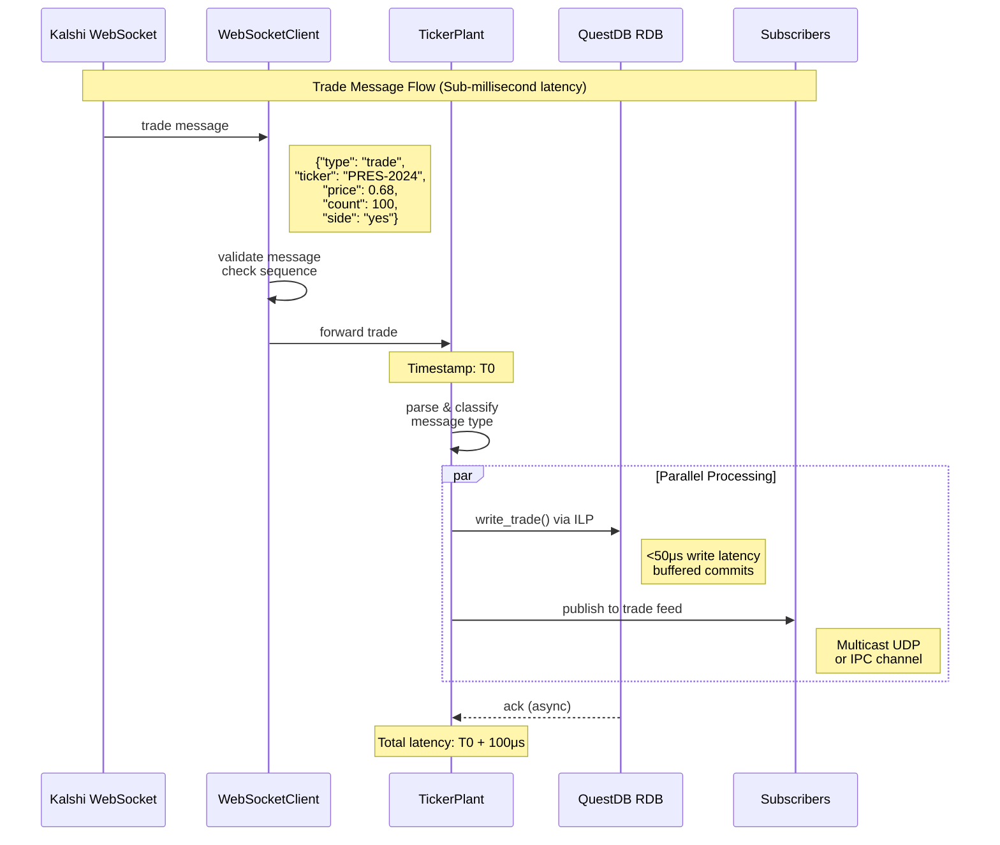
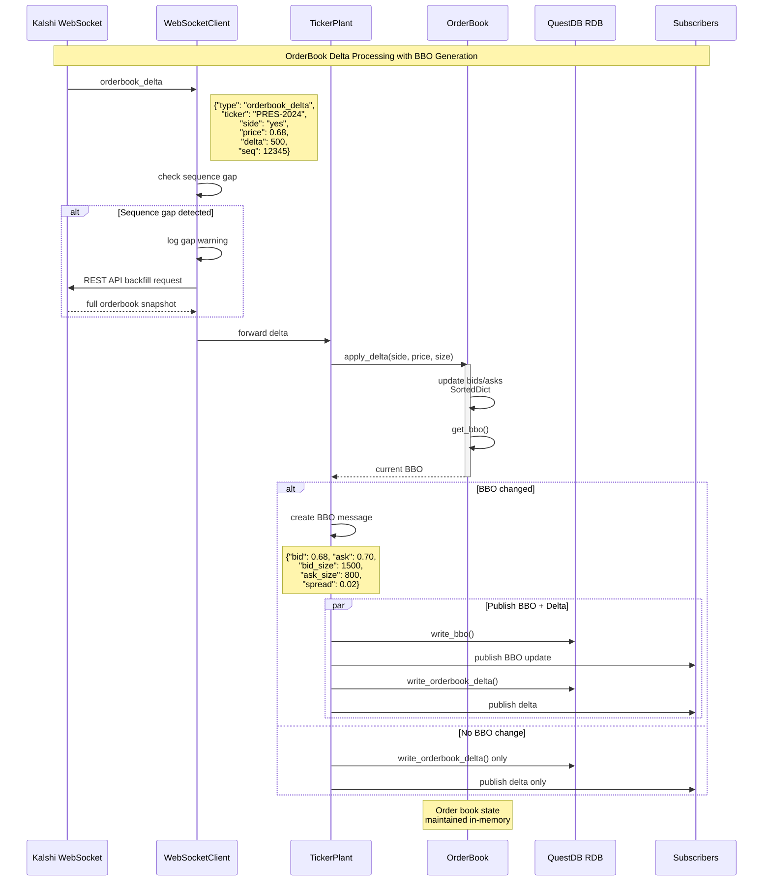
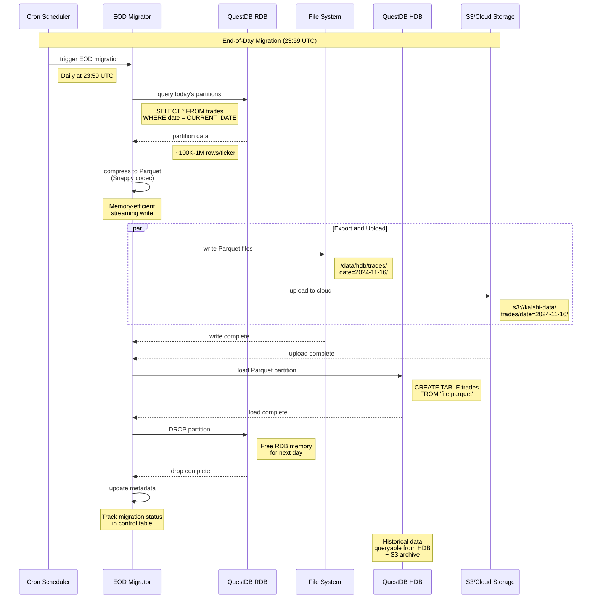
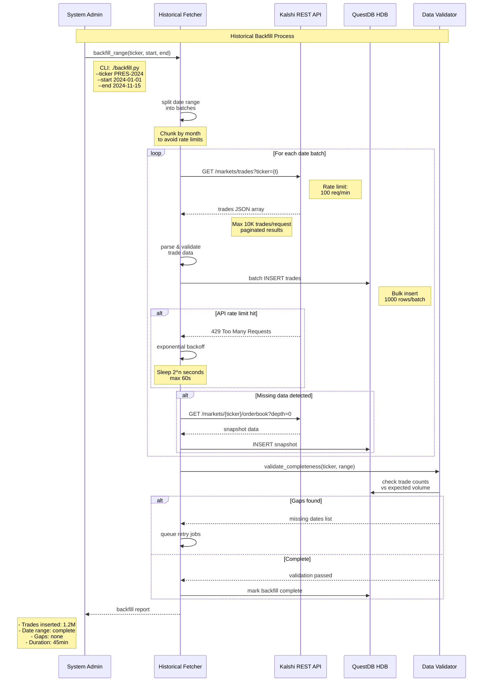
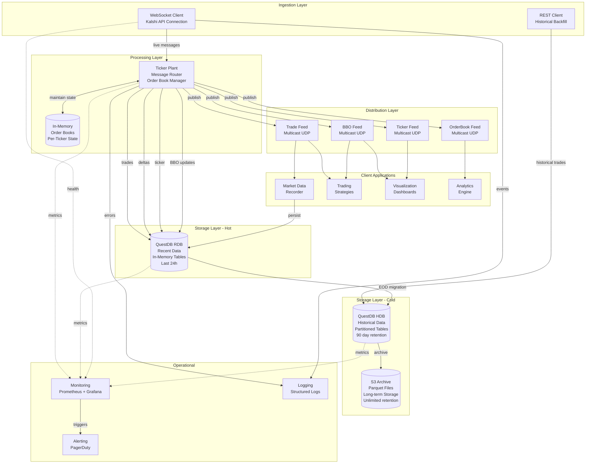

## Kalshi Data Platform (Python)

Minimal, production-focused toolkit for ingesting, normalizing, and persisting Kalshi market data. The repository ships with:

- **Public REST client** with CLI demo (`kalshi_platform.tools.public_demo`)
- **Async WebSocket client** and ticker plant primitives
- **QuestDB hot/warm writers** (`storage/questdb_rdb.py`, `storage/questdb_hdb.py`)
- **Historical backfill + recorder CLIs** using RSA-signed authentication
- **Docker + `.env` workflow** for reproducible local runs

All extraneous UML/diagram content was removed—everything below is actionable setup material.

---

## Quick Start (Native Python)

```bash
python -m venv .venv
. .venv/Scripts/activate        # Windows PowerShell
pip install -r requirements.txt
cp env.example .env              # fill in keys + QuestDB host/port
python -m kalshi_platform.tools.public_demo --series KXHIGHNY
```

### Environment Variables

- `env.example` documents every required value.
- `.env` is intentionally ignored—never commit secrets.
- All CLI tools load `.env` automatically; CLI flags override env values.

Key pairs to set:

| Variable | Purpose |
| --- | --- |
| `KALSHI_API_KEY` / `KALSHI_PRIVATE_KEY_PATH` | RSA-authenticated REST calls |
| `QUESTDB_RDB_HOST` / `QUESTDB_RDB_PORT` | QuestDB ILP writer target |
| `QUESTDB_HDB_*` | Historical SQL interface |
| `KALSHI_WS_URL` / `KALSHI_WS_AUTH_TOKEN` | WebSocket ingestion |

---

## Running the Tooling

| Command | Description |
| --- | --- |
| `python -m kalshi_platform.tools.public_demo --series KXHIGHNY` | Snapshot REST demo (series → markets → orderbook → trades) |
| `python -m kalshi_platform.tools.market_data_recorder --feed-file data/feed.jsonl` | Replay JSONL dumps into QuestDB (uses env QuestDB host/port) |
| `python -m kalshi_platform.tools.historical_fetcher --ticker PRES-2024 --start 2024-01-01 --end 2024-01-07` | Authenticated historical backfill with env fallbacks |

Notes:

- Recorder expects JSONL with `{"channel": "...", "message": {...}}`.
- Historical fetcher uses exponential backoff for `429` responses.
- All tools honor `KALSHI_BASE_URL` and `QUESTDB_*` when flags are omitted.

---

## Docker Workflow

> Requires Docker Desktop or equivalent.

### Build Base Image

```bash
docker build -t kalshi-platform .
```

### One-off CLI Runs

```bash
# Run public demo inside the container, mounting your .env + keys
docker run --rm --env-file .env ^
  -v %cd%/keys:/app/keys ^
  kalshi-platform ^
  python -m kalshi_platform.tools.public_demo --series KXHIGHNY
```

### docker compose (app + QuestDB)

```bash
docker compose up -d questdb          # start QuestDB
docker compose run --rm app pytest    # run tests inside container
docker compose run --rm app python -m kalshi_platform.tools.historical_fetcher --ticker ...
```

`docker-compose.yml` defines:

- `app`: Python image with dependencies installed.
- `questdb`: Official QuestDB image exposing ILP (9009), SQL (8812), and UI (9000).

---

## Testing

```bash
python -m pytest -v
# or inside Docker
docker compose run --rm app pytest -v
```

All tests live under `tests/` and cover order books, QuestDB writers, WebSocket helpers, and tooling.

### QuestDB Data Verification (manual)

1. Backfill a sample range into QuestDB hot storage:
   ```
   python -m kalshi_platform.tools.historical_fetcher \
     --ticker KXINXY-25DEC31-B7300 \
     --start 2025-11-10 \
     --end 2025-11-16
   ```
2. Open the QuestDB web console at `http://localhost:9000` and run:
   ```
   SELECT * FROM trades
   WHERE ticker='KXINXY-25DEC31-B7300'
   ORDER BY timestamp DESC
   LIMIT 20;
   ```

---

## Project Structure

```
kalshi_platform/
├── api/                 # Public REST helpers
├── config.py            # Env/dataclass loaders
├── ingestion/           # WebSocket client
├── storage/             # QuestDB adapters
├── ticker_plant/        # Order book + processor
└── tools/               # CLI entrypoints
```

Auxiliary files:

- `env.example` – environment template
- `Dockerfile`, `docker-compose.yml`, `.dockerignore`

---

## Common Tasks

- **Backfill trades to QuestDB**  
  `docker compose run --rm app python -m kalshi_platform.tools.historical_fetcher --ticker KALSHI-MKT --start 2024-11-01 --end 2024-11-07`

- **Record live WebSocket feed**  
  Stream to JSONL externally, then  
  `python -m kalshi_platform.tools.market_data_recorder --feed-file data/live.jsonl`

- **Extend ticker plant**  
  Implement publishers by subclassing or replacing `InMemoryPublisher` inside `ticker_plant/processor.py`.

---

Happy building.

## Public REST Client & Data Preview Tools

The `kalshi_platform/api/public_client.py` module wraps the publicly documented endpoints at [`https://api.elections.kalshi.com/trade-api/v2`](https://docs.kalshi.com/getting_started/quick_start_market_data). Two developer-focused entry points are provided:

- **Series → Markets → Orderbook demo** (mirrors the diagrammed flow in Section 5):  
  `python -m kalshi_platform.tools.public_demo --series KXHIGHNY`
- **Historical JSON previewer** for large S3 snapshots (adapted from the user-provided script above):  
  `python -m kalshi_platform.tools.market_data_preview --url https://kalshi-public-docs.s3.amazonaws.com/reporting/market_data_2023-11-13.json --interactive`

Both commands operate without API keys and rely solely on the unauthenticated endpoints described in the quick start guide. For paginated trade retrievals (`GET /markets/trades`), the client follows the cursor semantics outlined in the official documentation ([link](https://docs.kalshi.com/api-reference/market/get-trades)).

---

## WebSocket Ingestion & Ticker Plant Implementation

Guided by the public architecture write-up from the University of Illinois Kalshi project ([GitLab reference](https://gitlab-03.engr.illinois.edu/ie421_high_frequency_trading_fall_2024/ie421_hft_fall_2024_group_08/group_08_project)), this repository now includes:

- `kalshi_platform/ingestion/ws_client.py`: an asyncio-based client that manages `wss://api.elections.kalshi.com/trade-api/ws/v2`, subscription fan-out, ping/pong heartbeats, and sequence-gap detection.
- `kalshi_platform/ticker_plant/order_book.py`: lock-free order book state modeled after the diagrams below, including BBO computation, spread detection, and fallback data structures when `sortedcontainers` is unavailable.
- `kalshi_platform/ticker_plant/processor.py`: a message router that mirrors the GitLab ESB/ticker plant flow by classifying `trade`, `ticker`, and `orderbook_delta` payloads, recomputing top-of-book updates, and publishing them through pluggable sinks (`InMemoryPublisher` for tests, QuestDB/multicast hooks later in this plan).
- `kalshi_platform/tests/`: unit tests that validate order book math, BBO publication, and sequence-gap detection. Run them with `PYTEST_DISABLE_PLUGIN_AUTOLOAD=1 python -m pytest` to avoid third-party plugin interference.

These components are drop-in building blocks for the Observer/State/Strategy patterns outlined in Section 1 of this README.

---

## QuestDB Persistence Layer

Hot-path (RDB) and historical (HDB) adapters live under `kalshi_platform/storage/`:

- `questdb_rdb.QuestDBRDBWriter` wraps the official `questdb.ingress.Sender`, formats trades/orderbook deltas/tickers/BBO rows, and converts millisecond timestamps to nanoseconds automatically.
- `questdb_hdb.QuestDBHDBClient` executes Postgres-wire SQL for daily migrations, Parquet exports, and retention cleanup. The generated statements mirror the schema optimizations documented in Section 5.1.

Configuration is sourced from `.env.example` (never commit actual `.env` secrets). Copy the template, adjust `QUESTDB_*` variables, and wire the adapters into your ingestion/ticker plant services.

---

## Recorder & Historical Backfill Tooling

- `kalshi_platform/tools/market_data_recorder.py`: consumes JSONL feeds (`{"channel":"trade","message":{...}}`) and batches them into QuestDB. Example:  
  `python -m kalshi_platform.tools.market_data_recorder --feed-file data/trades.jsonl --questdb-host localhost`
- `kalshi_platform/tools/historical_fetcher.py`: uses the RSA-signed authentication flow showcased in the provided snippet to hit the authenticated `/trade-api/v2/markets/trades` endpoint ([docs](https://docs.kalshi.com/api-reference/market/get-trades)). Example backfill:  
  `python -m kalshi_platform.tools.historical_fetcher --ticker PRES-2024 --start 2024-01-01 --end 2024-01-07 --api-key <ID> --private-key keys/kalshi_private.pem`

The fetcher implements exponential backoff for `429 Too Many Requests` responses, mirroring the Historical Backfill diagram in Section 5 and the GitLab team's production workflow. Both tools rely on the QuestDB writers above, so recorded data lands in the same schema as the real-time flow.

---

## 1. Class Diagram: Core Components

**Purpose**: Object-oriented design showing primary system classes, their attributes, methods, and relationships.



**Key Design Patterns**:
- **Observer**: Ticker plant publishes to multiple subscribers via multicast
- **State**: OrderBook maintains mutable bid/ask state with sequence tracking
- **Strategy**: Message routing based on type classification

---

## 2. Sequence Diagram: Trade Message Flow

**Purpose**: Real-time trade message processing with sub-millisecond latency requirements.



**Critical Path Optimization**:
- Parallel database write and subscriber publish
- Non-blocking ILP protocol to QuestDB
- Zero-copy message serialization where possible

---

## 3. Sequence Diagram: OrderBook Delta Processing

**Purpose**: In-memory order book reconstruction with BBO change detection.



**Recovery Strategy**:
- Sequence number gap detection triggers REST API snapshot fetch
- Full book reconstruction from snapshot baseline
- Delta replay to restore current state

---

## 4. Sequence Diagram: End-of-Day Migration

**Purpose**: Batch process migrating hot RDB data to persistent HDB storage with cloud archival.



**Storage Tier Strategy**:
- RDB: 24h hot data (in-memory, fast queries)
- HDB: 90d warm data (disk-based, partitioned)
- S3: Unlimited cold storage ($0.023/GB/month)

---

## 5. Sequence Diagram: Historical Backfill

**Purpose**: Bulk historical data retrieval from Kalshi REST API with rate limiting and validation.



**Rate Limiting Strategy**:
- Exponential backoff on 429 responses: sleep(2^retry_count)
- Maximum backoff: 60 seconds
- Request batching: 10K trades per API call

---

## Kalshi API References

- [`GET /exchange/status`](https://docs.kalshi.com/api-reference/exchange/get-exchange-status): liveness and trading-state probe used by operations tooling before bringing ingestion online.
- [`GET /markets/trades`](https://docs.kalshi.com/api-reference/market/get-trades): primary REST feed for the `HistoricalDataFetcher` loop (`ticker`, `min_ts`, `max_ts`, `limit`, and `cursor` parameters map directly to the batching logic in Section 5).
- [`GET /markets/{ticker}/orderbook`](https://docs.kalshi.com/api-reference/market/get-market-orderbook): snapshot API the WebSocket client hits when a sequence gap is detected; requesting `depth=0` ensures a full book reconstruction.
- [`Public Trades` WebSocket](https://docs.kalshi.com/websockets/public-trades): backing specification for the `KalshiWebSocketClient` connection (`wss://api.elections.kalshi.com/trade-api/ws/v2`) that drives real-time ingestion and multicast fan-out.

All REST calls share the documented base URL `https://api.elections.kalshi.com/trade-api/v2`, so the relative paths described throughout the diagrams remain valid once prefixed with that host.

---

## 6. Component Architecture Diagram

**Purpose**: System-level view showing data flow through all architectural layers.



**Architectural Layers**:

1. **Ingestion**: Dual-path data acquisition (real-time WebSocket + batch REST)
2. **Processing**: Stateful ticker plant with order book reconstruction
3. **Storage**: Three-tier approach optimizing cost vs. access patterns
4. **Distribution**: Type-specific multicast feeds for fan-out efficiency
5. **Operational**: Full observability stack with metrics, logs, alerts

---

## Performance Characteristics

### Latency Targets

| Operation | Target | Notes |
|-----------|--------|-------|
| Trade ingestion → DB | <100μs | ILP buffered writes |
| BBO calculation | <50μs | In-memory sorted dict operations |
| End-to-end (Kalshi → subscriber) | <500μs | Including network propagation |
| Database query (recent data) | <10ms | RDB in-memory indexes |
| Historical query (1 day) | <100ms | HDB partition pruning |

### Throughput Capacity

| Metric | Capacity | Scaling Strategy |
|--------|----------|------------------|
| Messages/second | 50,000 | Horizontal ticker plant sharding |
| Concurrent subscribers | 100+ | Multicast UDP (unlimited theoretical) |
| Historical backfill rate | 1M trades/hour | Parallel API requests with rate limiting |
| Storage growth | ~10GB/day | Compressed Parquet + S3 archival |

### Resource Requirements

| Component | CPU | Memory | Storage |
|-----------|-----|--------|---------|
| Ticker Plant | 4 cores | 8GB | Minimal |
| QuestDB RDB | 4 cores | 16GB | 50GB SSD |
| QuestDB HDB | 8 cores | 32GB | 500GB SSD + S3 |
| Total (production) | 16 cores | 56GB | 550GB + S3 |

---

## Implementation Notes

### QuestDB Schema Optimizations

```sql
-- Designated timestamp enables O(log n) time-range queries
CREATE TABLE trades (
    ticker SYMBOL capacity 256 CACHE,  -- Symbol interning for memory efficiency
    timestamp TIMESTAMP,                -- Designated timestamp column
    trade_id STRING,                    -- Unique trade identifier
    price DOUBLE,
    volume LONG,
    taker_side SYMBOL capacity 4       -- 'yes', 'no', or 'none'
) timestamp(timestamp) PARTITION BY DAY;  -- Daily partitions for lifecycle management

CREATE TABLE orderbook_deltas (
    ticker SYMBOL capacity 256 CACHE,
    timestamp TIMESTAMP,
    sequence LONG,
    side SYMBOL capacity 4, -- 'yes' or 'no'
    price DOUBLE,
    delta_size LONG
) timestamp(timestamp) PARTITION BY DAY;

-- Index frequently filtered columns
ALTER TABLE trades ALTER COLUMN ticker ADD INDEX;

-- Pre-aggregate common queries
CREATE TABLE ohlc_1m AS (
    SELECT ticker, timestamp, 
           first(price) as open, 
           max(price) as high,
           min(price) as low,
           last(price) as close,
           sum(volume) as volume
    FROM trades
    SAMPLE BY 1m ALIGN TO CALENDAR
);
```

### Ticker Plant Performance Patterns

```python
# Lock-free order book updates using copy-on-write
class OrderBook:
    def apply_delta(self, side: str, price: float, delta: int):
        """
        Non-blocking delta application with immutable snapshots.
        
        Uses Python's sorted containers library (C-optimized)
        for O(log n) insert/delete operations.
        """
        book = self.bids if side == 'yes' else self.asks
        current = book.get(price, 0)
        new_size = current + delta
        
        if new_size <= 0:
            del book[price]  # O(log n) deletion
        else:
            book[price] = new_size  # O(log n) insertion
```

### Multicast Distribution

```python
# Aeron IPC for same-host zero-copy
AERON_CHANNEL = "aeron:ipc"  # Shared memory transport

# Multicast UDP for cross-host
AERON_CHANNEL = "aeron:udp?endpoint=239.1.1.1:40456|interface=eth0"

# Reliability: Use stream IDs for message type separation
TRADE_STREAM_ID = 1001
BBO_STREAM_ID = 1002
TICKER_STREAM_ID = 1003
```

---

## Deployment Configuration

### Docker Compose Stack

```yaml
version: '3.8'

services:
  questdb-rdb:
    image: questdb/questdb:7.3.10
    environment:
      - QDB_CAIRO_MAX_UNCOMMITTED_ROWS=100000
      - QDB_LINE_TCP_ENABLED=true
      - QDB_HTTP_ENABLED=true
    ports:
      - "9000:9000"   # Web console
      - "9009:9009"   # ILP ingestion
      - "8812:8812"   # PostgreSQL wire
    volumes:
      - rdb-data:/var/lib/questdb
    deploy:
      resources:
        limits:
          memory: 16G
        reservations:
          memory: 8G

  ticker-plant:
    build: ./ticker-plant
    environment:
      - QUESTDB_HOST=questdb-rdb
      - QUESTDB_PORT=9009
      - KALSHI_WS_URL=wss://api.elections.kalshi.com/trade-api/ws/v2
      - LOG_LEVEL=INFO
    depends_on:
      - questdb-rdb
    network_mode: host  # Required for multicast on Linux
```

### Kubernetes StatefulSet (Production)

```yaml
apiVersion: apps/v1
kind: StatefulSet
metadata:
  name: questdb-hdb
spec:
  serviceName: questdb
  replicas: 1
  selector:
    matchLabels:
      app: questdb-hdb
  template:
    spec:
      containers:
      - name: questdb
        image: questdb/questdb:7.3.10
        resources:
          requests:
            memory: "32Gi"
            cpu: "8"
          limits:
            memory: "64Gi"
            cpu: "16"
        volumeMounts:
        - name: data
          mountPath: /var/lib/questdb
  volumeClaimTemplates:
  - metadata:
      name: data
    spec:
      accessModes: [ "ReadWriteOnce" ]
      storageClassName: fast-ssd
      resources:
        requests:
          storage: 500Gi
```

---

## Monitoring Queries

### Prometheus Metrics

```python
# Ticker plant metrics
TRADES_PROCESSED = Counter('kalshi_trades_processed_total', 'Total trades processed')
BBO_UPDATES = Counter('kalshi_bbo_updates_total', 'BBO updates generated')
PROCESSING_LATENCY = Histogram('kalshi_processing_latency_seconds', 'Message processing latency')
SEQUENCE_GAPS = Counter('kalshi_sequence_gaps_total', 'Sequence number gaps detected')

# QuestDB metrics
DB_WRITE_LATENCY = Histogram('questdb_write_latency_seconds', 'Database write latency')
DB_ROW_COUNT = Gauge('questdb_row_count', 'Total rows in table', ['table'])
```

### Alert Rules

```yaml
groups:
- name: kalshi_platform
  rules:
  - alert: HighProcessingLatency
    expr: histogram_quantile(0.99, kalshi_processing_latency_seconds) > 0.001
    for: 5m
    annotations:
      summary: "P99 processing latency exceeds 1ms"
      
  - alert: SequenceGapDetected
    expr: rate(kalshi_sequence_gaps_total[5m]) > 0
    annotations:
      summary: "Missing WebSocket messages detected"
      
  - alert: DatabaseWriteBacklog
    expr: questdb_uncommitted_rows > 500000
    for: 5m
    annotations:
      summary: "QuestDB write buffer filling up"
```